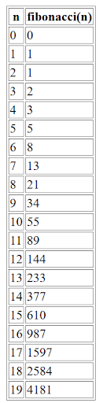

# 02 Custom HTML

The `fibonacci.cpp` file defines a C++ function `int fibonacci(int n)`.

To compile it, run:

```sh
em++ fibonacci.cpp -o fibonacci.js
```

To serve the generated HTML page, use:

```sh
python -m http.server
```

Then open [http://localhost:8000/index.html](http://localhost:8000/index.html) in your browser.

You should see a table like this:


